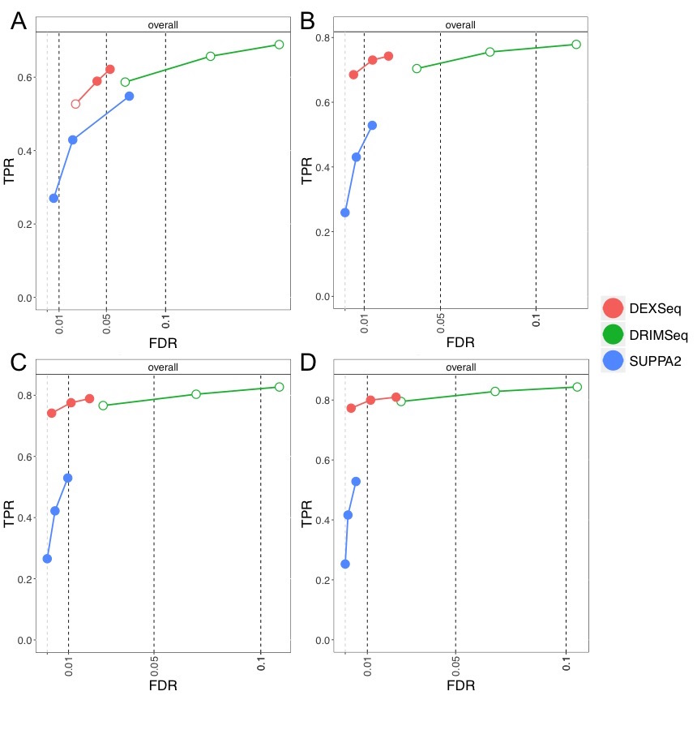
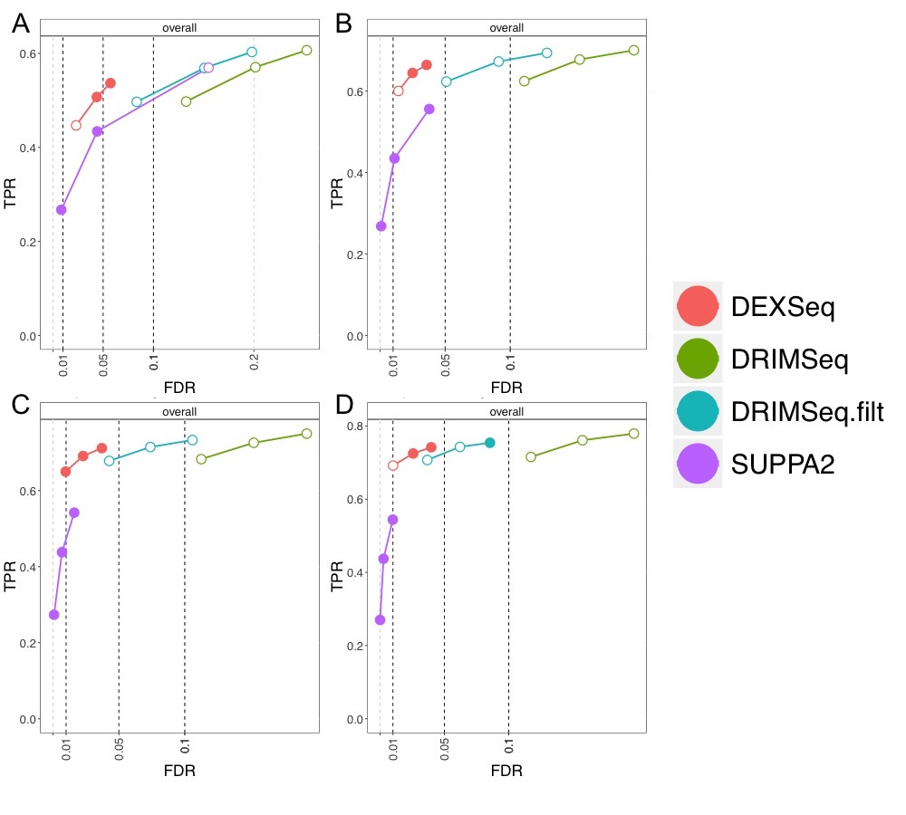
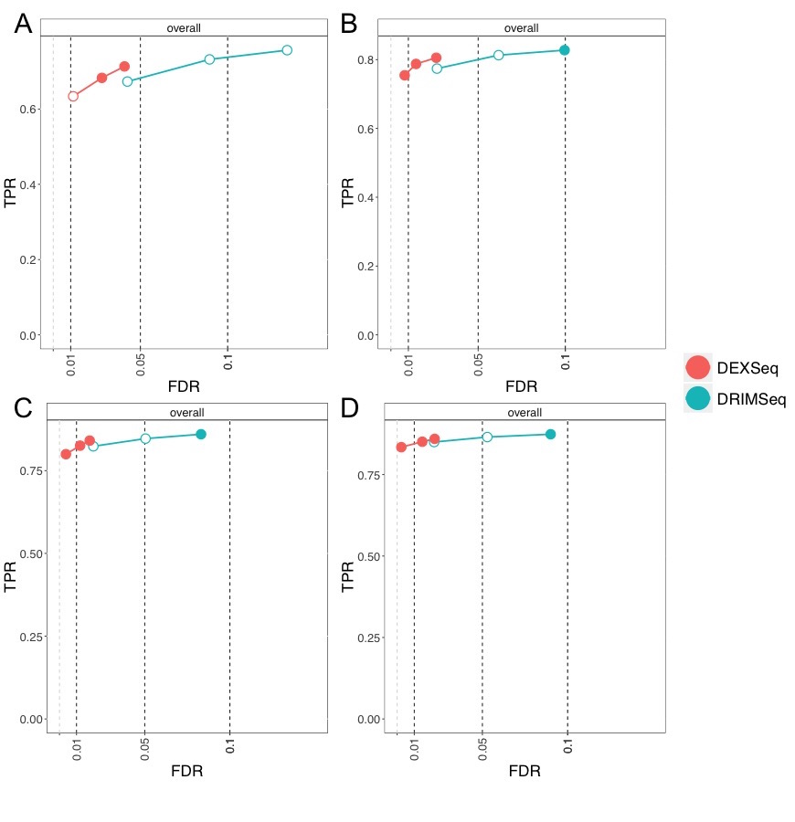
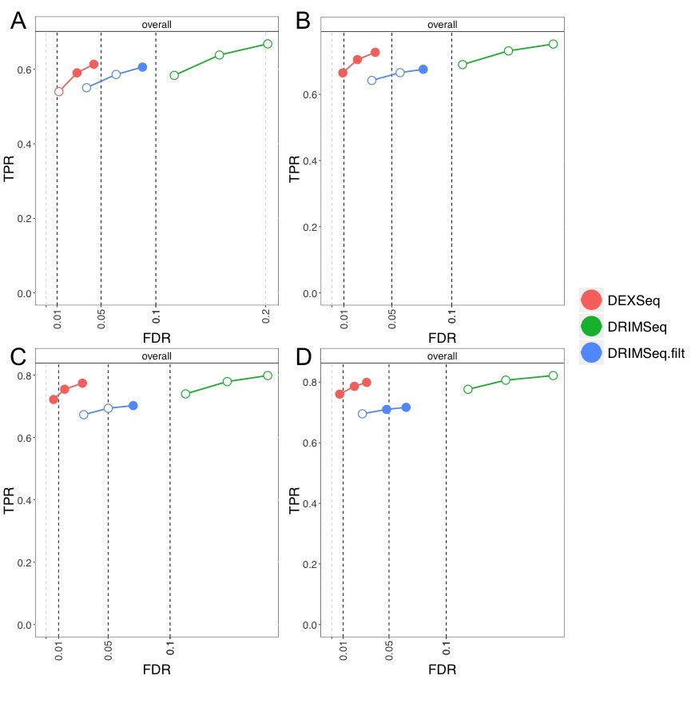
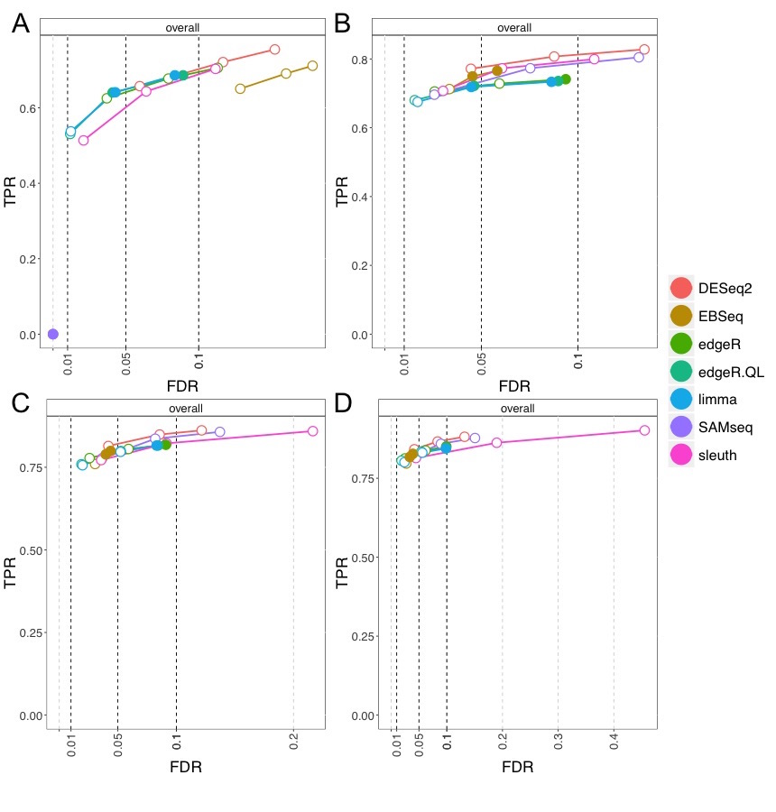
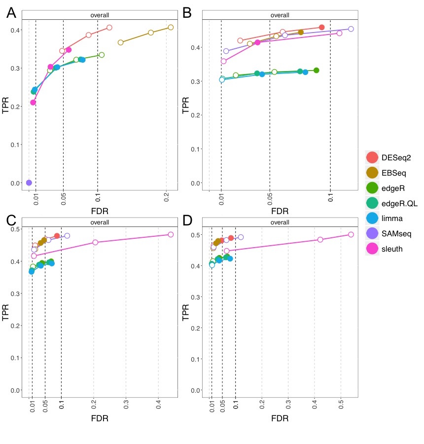

<!-- to compile this: 
  devtools::install()
  rmarkdown::render("rnaseqDTU.Rmd")
-->

<!-- a list of all required libraries:
  reqlibs = sub(".*library\\((.*?)\\).*","\\1",grep("library\\(",readLines("rnaseqDTU.Rmd"),value=TRUE))
  find.package(reqlibs)
-->

```{r style, echo=FALSE, message=FALSE, warning=FALSE, results="asis"}
library(knitr)
library(rmarkdown)
opts_chunk$set(message=TRUE, warning=FALSE, error=FALSE, 
               cache=TRUE, fig.width=5, fig.height=5)
```

**R version**: `r R.version.string`

**Bioconductor version**: `r BiocInstaller::biocVersion()`

<!-- fix this to rnaseqDTU later -->
**Package**: `r packageVersion("DRIMSeq")`

# Introduction

RNA-seq experiments can be analyzed to detect differences across groups of
samples in total gene expression -- the total expression 
produced by all isoforms of a gene -- and additionally differences in
transcript usage within a gene. If the amount of expression
switches among two or more isoforms of a gene, then the total gene
expression may not change by a detectable amount, but 
the differential transcript usage is nevertheless biologically relevant.
While many tutorials and workflows in the
Bioconductor project address differential gene expression, there are
fewer workflows for performing a differential transcript usage analysis,
which provides critical and complementary information to a 
gene-level analysis. Some of the existing Bioconductor packages and functions that 
can be used to detect differential transcript usage include 
*BitSeq* [@Glaus2012Identifying], 
*DEXSeq* (originally designed for differential exon usage) [@Anders2012Detecting], 
`diffSpliceDGE` from the *edgeR* package [@Robinson2009EdgeR;@McCarthy2012Differential],
`diffSplice` from the *limma* package [@Smyth2004Linear;@Law2014Voom],
*DRIMSeq* [@Nowicka2016DRIMSeq],
*stageR* [@Van2017StageR], and
*SGSeq* [@Goldstein2016SGSeq].
The Bioconductor package *IsoformSwitchAnalyzeR* [@Vitting2017] is
well documented and can be seen as an alternative to this workflow; 
*IsoformSwitchAnalyzeR* allows for import of data from various 
quantification methods, including *Salmon*, and allows for statistical
inference using *DRIMSeq*, as well as a rank-based statistical test of
transcript proportions. In addition, *IsoformSwitchAnalyzeR* includes
functions for obtaining the nucleotide and amino acid sequence
consequences of isoform switching, which is not covered in this
workflow.
Other packages related to splicing can be found at the 
[DifferentialSplicing BiocViews](https://bioconductor.org/packages/release/BiocViews.html#___DifferentialSplicing).
For more information about the Bioconductor project and its core
infrastructure, please refer to the overview by @Huber2015Orchestrating.

We note that there are numerous other methods for detecting
differential transcript usage outside of the Bioconductor project. The
*DRIMSeq* publication is a good reference for these, having descriptions and
comparisons with many current methods [@Nowicka2016DRIMSeq].
This workflow will build on the methods and vignettes from three
Bioconductor packages: *DRIMSeq*, *DEXSeq*, and *stageR*.

Previously, some of the developers of the Bioconductor packages 
*edgeR* and *DESeq2* have collaborated to develop the
*tximport* package [@Soneson2015Differential] for summarizing the output of fast
transcript-level quantifiers, such as *Salmon* [@Patro2017Salmon],
*Sailfish* [@Patro2014Sailfish], and *kallisto* [@Bray2016Near]. The *tximport* package focuses on
preparing estimated transcript-level counts, abundances
and effective transcript lengths, for gene-level statistical analysis
using *edgeR* [@Robinson2009EdgeR], *DESeq2* [@Love2014Moderated] or
*limma-voom* [@Law2014Voom]. *tximport* produces an 
offset matrix to accompany gene-level counts, that accounts for
a number of RNA-seq biases as well as differences in
transcript usage among transcripts of different length that would bias
an estimator of gene fold change based on the gene-level counts
[@Trapnell2013Differential]. 
*tximport* can alternatively produce a matrix of data that
is roughly on the scale of counts, by scaling transcript-per-million
(TPM) abundances to add up to 
the total number of mapped reads. This counts-from-abundance approach
directly corrects for technical biases and differential transcript
usage across samples, obviating the need for the accompanying offset matrix.

Complementary to an analysis of differential gene expression, one can
use *tximport* to import transcript-level estimated counts, and then pass these
counts to packages such as *DRIMSeq* or *DEXSeq* for statistical
analysis of differential transcript usage. Following a
transcript-level analysis, one can aggregate evidence of differential
transcript usage to the gene level. The *stageR* package in
Bioconductor provides a statistical framework to *screen* at the
gene-level for differential transcript usage with gene-level adjusted p-values,
followed by *confirmation* of which transcripts within the significant
genes show differential usage with transcript-level adjusted p-values
[@Van2017StageR]. The method controls the _overall false discovery
rate_ (OFDR)
[@Heller2009] for such a two-stage procedure, which will be discussed
in more detail later in the 
workflow. We believe that *stageR* represents a principled approach to
analyzing transcript usage changes, as the methods can be evaluated
against a target error rate in a manner that mimics how the methods
will be used in practice. That is, following rejection of
the null hypothesis at the gene-level, investigators would likely
desire to know which transcripts within a gene participated in the
differential usage.

Here we provide a basic workflow for detecting
differential transcript usage using Bioconductor packages,
following quantification of transcript abundance using the *Salmon*
method. This workflow includes live, runnable code chunks for analysis
using *DRIMSeq* and *DEXSeq*, as well as for performing stage-wise
testing of differential transcript usage using the *stageR*
package. For the workflow, we use data which is simulated, so that 
we can also evaluate the performance of methods for differential
transcript usage, as well as differential gene and transcript
expression. The simulation was constructed using distributional
parameters estimated from the GEUVADIS project RNA-seq dataset
[@Lappalainen2013Transcriptome] quantified by the *recount2* project
[@Collado2017Recount], including the 
expression levels of the transcripts, the amount of biological
variability of gene expression levels across samples, and realistic coverage
of reads along the transcript.

# Methods

## Simulation

First we describe details of the simulated data, which will be used in
the following workflow. Understanding the details of the
simulation will be useful for assessing the methods in the later sections.
All of the code used to simulate RNA-seq experiments and write
paired-end reads to FASTQ files can be found at an associated GitHub repository for
the simulation code [@swimdown], and the reads and quantification
files can be downloaded from Zenodo [@swimdowndata].
*Salmon* [@Patro2017Salmon] was used to estimate transcript-level abundances for a single
sample (ERR188297) of the GEUVADIS project
[@Lappalainen2013Transcriptome], and this was used as
a baseline for transcript abundances in the simulation. Transcripts
which were associated with estimated counts less than 10 had abundance
thresholded to 0, all other transcripts were considered "expressed".
*alpine* [@Love2016Alpine] was used to estimate realistic fragment GC
bias from 12 samples from the GEUVADIS 
project, all from the same sequencing center (the first 12 samples from
CNAG-CRG in Supplementary Table 2 from @Love2016Alpine). 
*DESeq2* [@Love2014Moderated] was used to estimate mean and dispersion
parameters for a Negative 
Binomial distribution for gene-level counts for 462 GEUVADIS samples
provided by the *recount2* project [@Collado2017Recount].
Note that, while gene-level dispersion estimates were used
to generate underlying transcript-level counts, additional uncertainty
on the transcript-level data is a natural consequence of the
simulation, as the transcript-level counts must be estimated (the
underlying transcript counts are not provided to the methods).

*polyester* [@Frazee2015Polyester] was used to simulate paired-end RNA-seq reads for two
groups of 12 samples each, with realistic fragment GC bias, and with
dispersion on transcript-level counts drawn from the joint distribution
of mean and dispersion values estimated from the GEUVADIS samples.
To compare *DRIMSeq* and *DEXSeq* in further detail, we generated
an additional simulation in which dispersion parameters were assigned
to genes via matching on the gene-level count, and then all
transcripts of a gene had counts generated using the same per-gene dispersion.
The first sample for group 1 and the first sample for group 2 followed the
realistic GC bias profile of the same GEUVADIS sample, and so on for all 12
samples. This pairing of the samples was used to generate balanced
data, but not used in the statistical analysis. 
*countsimQC* [@Soneson2017Towards] was used to
examine the properties of the simulation relative to the dataset used
for parameter estimation, and the full report can be accessed at the
associated GitHub repository for simulation code [@swimdown].

Differential expression across two groups was generated as follows:
70% of the genes were set as "null genes", where abundance was not
changed across the two groups. For 10% of genes, all isoforms were
differentially expressed at a log fold change between 1 and 2.58 (fold
change between 2 and 6). The set of transcripts in these genes were
classified as DGE (differential 
gene expression) by construction, and the expressed genes were also
DTE (differential transcript expression), but they did not count as
DTU (differential transcript usage), as the proportions within the
gene remain constant. To simulate balanced differential expression, one of
the two groups was randomly chosen to be the baseline, and the other group
would have its counts multiplied by the fold change. For 10% of genes,
a single expressed isoform was differentially expressed at a log fold
change between 1 and 2.58. This set of transcripts was DTE by
construction. If the chosen transcript was the only expressed isoform
of a gene, this counted also as DGE and not as DTU, but if there were
other isoforms which are expressed, such genes counted for both DGE
and DTU, as the proportion of expression among the isoforms was
affected. For 10% of genes, differential transcript
usage was constructed by exchanging the TPM abundance of two expressed
isoforms, or, if only one isoform was expressed, exchanging the
abundance of the expressed isoform with a non-expressed one. Such
genes counted for DTU and DTE, but not for DGE. An MA plot of the
simulated abundances for the two groups is shown in Figure
\@ref(fig:ma-simulated).

```{r ma-simulated, message=FALSE, echo=FALSE, dev="png", out.width="50%", fig.cap="MA plot of simulated abundances. Each point depicts a transcript, with the average log2 abundance (TPM) on the x-axis and the difference between the two groups on the y-axis. Of the transcripts which are expressed with TPM > 1 in at least one group, 77\\% are null transcripts (grey), which fall by construction on the M=0 line, and 23\\% are differentially expressed (green, orange, or purple). As transcripts can belong to multiple categories of DGE, DTE, and DTU, here the transcripts are colored by which genes they belong to (thoses selected to be DGE-, DTE-, or DTU-by-construction)."}
library(rnaseqDTU)
library(rafalib)
data(simulate)
bigpar()
pc <- 1
col <- rep(8, nrow(tpms))
col[iso.dge] <- 1
col[iso.dte] <- 2
col[iso.dtu] <- 3
maplot(log2(tpms[,1]+pc), log2(tpms[,2]+pc),
       n=nrow(tpms), curve.add=FALSE,
       col=col, cex=.25, pch=20)
legend("bottomright",
       c("DGE","DTE","DTU","null"),
       col=c(1:3,8), pch=20, bty="n")
```

## Operation

This workflow was designed to work with R 3.5 or higher, and the
*DRIMSeq*, *DEXSeq*, *stageR*, and *tximport* packages for Bioconductor
version 3.7 or higher. Bioconductor packages should always be
installed following the [official instructions](https://bioconductor.org/install).
The workflow uses a subset of all genes to speed
up the analysis, but the Bioconductor packages can easily be run for
this dataset on all human genes on a laptop in less than an
hour. Timing for the various packages is included within each section.

# Quantification and data import

## Salmon quantification

We used *Salmon* version 0.10.0 to quantify abundance and effective transcript 
lengths for all of the 24 simulated samples. For this workflow, we
will use the first six samples from each group. We quantified against
the [GENCODE](https://www.gencodegenes.org/releases/current.html)
human annotation version 28, which was the same reference used to
generate the simulated reads. We used the transcript sequences FASTA
file which contains "Nucleotide sequences of all transcripts on the
reference chromosomes". When downloading the FASTA file, it is useful
to download the corresponding GTF file, as this will be used in later
sections. 

To build the *Salmon* index, we used the following command. Recent
versions of *Salmon* will discard identical sequence duplicate
transcripts, and keep a log of these within the index directory.

```
salmon index -t gencode.v28.transcripts.fa -i gencode.v28_salmon-0.10.0
```

To quantify each sample, we used the following command, which says to
quantify with six threads using the GENCODE index, with inward and
unstranded paired end reads, using fragment GC bias correction,
writing out to the directory `sample` and using as input these two
reads files. The library type is specified by `-l IU` (inward and
unstranded) and the options are discussed in the 
[Salmon documentation](http://salmon.readthedocs.io/en/latest/library_type.html). 
Recent versions of Salmon can automatically detect the library type by
setting `-l A`. Such a command can be automated in a bash loop using
bash variables, or one can use more advanced workflow management
systems such as Snakemake [@Koster2012Snakemake] or Nextflow
[@Di2017Nextflow]. 

```
salmon quant -p 6 -i gencode.v28_salmon-0.10.0 -l IU \
      --gcBias -o sample -1 sample_1.fa.gz -2 sample_2.fa.gz
```

## Importing counts into R/Bioconductor

We can use *tximport* to import the estimated counts, abundances and
effective transcript lengths into R. We recommend to construct a CSV file
that keeps track of the sample identifiers and any relevant variables,
e.g. condition, time point, batch, and so on. Here we have made a
sample CSV file and provided it along with this workflow's R package.

In order to find this file, we first need to know where on the machine
this workflow package lives, so we can point to the `extdata`
directory where the CSV file is located. These two lines of code load
the workflow package and find this directory on the machine. These two
lines of code would therefore not be part of a *typical* workflow.

```{r}
library(rnaseqDTU)
csv.dir <- system.file("extdata", package="rnaseqDTU")
```

The CSV file records which samples are condition 1 and which are
condition 2. The columns of this CSV file can have any names, although
`sample_id` will be used later by *DRIMSeq*, and so using this column
name allows us to pass this *data.frame* directly to *DRIMSeq* at a
later step.

```{r}
samps <- read.csv(file.path(csv.dir, "samples.csv"))
head(samps)
samps$condition <- factor(samps$condition)
table(samps$condition)
files <- file.path("/path/to/dir", samps$sample_id, "quant.sf")
names(files) <- samps$sample_id
head(files)
```

We can then import transcript-level counts using *tximport*.
We suggest for DTU analysis to generate counts from abundance, using the
`scaledTPM` method described by @Soneson2015Differential. 
The `countsFromAbundance` option of *tximport* uses estimated
abundances to generate roughly count-scaled data, such that each
column will sum to the number of reads mapped for that library. 
We recommend `scaledTPM` for differential transcript usage
so that the estimated proportions fit by *DRIMSeq* in
the following sections correspond to the proportions of underlying
abundance. 

If instead of `scaledTPM`, we used the original estimated transcript counts
(`countsFromAbundance="no"`), or if we used `lengthScaledTPM`
transcript counts, then a change in transcript usage among
transcripts of different length could result in a changed total count
for the gene, even if there is no change in total gene
expression. This is because the original transcript counts and
`lengthScaledTPM` transcript counts scale with transcript
length, while `scaledTPM` transcript counts do not. For testing DTU
using *DRIMSeq* and *DEXSeq*, it is convenient if the count-scale data
do *not* scale with transcript length within a gene.
Note that this could be corrected by an offset, but this is not
easily implemented in the current DTU analysis packages. While this workflow only
considers existing software features, we are considering developing a new
`countsFromAbundance` method which would scale abundance for all
transcripts of a gene by a fixed gene length, then each sample by its
number of mapped reads, therefore balancing between the benefits of
`scaledTPM` and `lengthScaledTPM`.

The following code chunk is not evaluated, but instead we will load a
pre-constructed matrix of counts. The actual quantification files for
this dataset have been made publicly available, see the *Data
availability* section at the end of this workflow.

```{r eval=FALSE}
library(tximport)
txi <- tximport(files, type="salmon", txOut=TRUE,
                countsFromAbundance="scaledTPM")
cts <- txi$counts
cts <- cts[rowSums(cts) > 0,]
```

## Transcript-to-gene mapping

Bioconductor offers numerous approaches for building a *TxDb* object,
a transcript database that can be used to link transcripts to genes
(among other uses).
We ran the following unevaluated code chunks to generate a *TxDb*,
and then used the `select` function with the *TxDb* to produce 
a corresponding *data.frame* called `txdf` which links transcript IDs
to gene IDs. In this *TxDb*, the transcript IDs are called `TXNAME` and
the gene IDs are called `GENEID`. The version 28 human GTF file was
downloaded from the GENCODE website when downloading the transcripts
FASTA file.

```{r eval=FALSE}
library(GenomicFeatures)
gtf <- "gencode.v28.annotation.gtf.gz"
txdb.filename <- "gencode.v28.annotation.sqlite"
txdb <- makeTxDbFromGFF(gtf)
saveDb(txdb, txdb.filename)
```

Once the *TxDb* database has been generated and saved, it can be
quickly reloaded: 

```{r eval=FALSE}
txdb <- loadDb(txdb.filename)
txdf <- select(txdb, keys(txdb, "GENEID"), "TXNAME", "GENEID")
tab <- table(txdf$GENEID)
txdf$ntx <- tab[match(txdf$GENEID, names(tab))]
```

# Statistical analysis of differential transcript usage

## DRIMSeq

We load the `cts` object as created in the *tximport* code chunks. This
contains count-scale data, generated from abundance using the
`scaledTPM` method. The column sums are equal to the number of mapped 
paired-end reads per experiment. The experiments have between 31 and
38 million paired-end reads that were mapped to the transcriptome
using *Salmon*.

```{r}
data(salmon_cts)
cts[1:3,1:3]
range(colSums(cts)/1e6)
```

We also have the `txdf` object giving the transcript-to-gene
mappings (for construction, see previous section). 
This is contained in a file called `simulate.rda` that
contains a number of R objects with information about the
simulation, that we will use later to assess the methods'
performance. 

```{r}
data(simulate)
head(txdf)
all(rownames(cts) %in% txdf$TXNAME)
txdf <- txdf[match(rownames(cts),txdf$TXNAME),]
all(rownames(cts) == txdf$TXNAME)
```

In order to run *DRIMSeq*, we build a *data.frame* with the gene ID,
the feature (transcript) ID, and then columns for each of the samples:

```{r}
counts <- data.frame(gene_id=txdf$GENEID,
                     feature_id=txdf$TXNAME,
                     cts)
```

We can now load the *DRIMSeq* package and create a *dmDSdata* object,
with our `counts` and `samps` *data.frames*. Typing in the object name
and pressing return will give information about the number of genes:

```{r}
library(DRIMSeq)
d <- dmDSdata(counts=counts, samples=samps)
d
```

The *dmDSdata* object has a number of specific methods. Note that the
rows of the object are gene-oriented, so pulling out the first *row*
corresponds to all of the transcripts of the first gene:

```{r}
methods(class=class(d))
counts(d[1,])[,1:4]
```

It will be useful to first filter the object, before running
procedures to estimate model parameters. This greatly speeds up the
fitting and removes transcripts which may be troublesome for
parameter estimation, e.g. estimating the proportion of expression
among the transcripts of a gene when the total count is very low. We first
define `n` to be the total number of samples, and `n.small` to be the
sample size of the smallest group. We use all
three of the possible filters: for a transcript to be retained in the dataset, 
we require that (1) it has a count of at least 10 in at least `n.small`
samples, (2) it has a relative abundance proportion of at least 0.1 in 
at least `n.small` samples, and (3) the total count of the corresponding gene 
is at least 10 in all `n` samples. We used all three possible filters, 
whereas only the two count
filters are used in the *DRIMSeq* vignette example code.

It is important to consider what types of transcripts may be removed
by the filters, and potentially adjust depending on the dataset.  If
`n` was large, it would make sense to allow perhaps a few samples to
have very low counts, so lowering `min_samps_gene_expr` to some
factor multiple ($< 1$) of `n`, and likewise for the first two filters for
`n.small`. The second filter means that if a transcript does not make
up more than 10% of the gene's expression for at least `n.small`
samples, it will be removed. If this proportion seems too high, for
example, if very lowly expressed isoforms are of particular interest,
then the filter can be omitted or the `min_feature_prop` lowered. For
a concrete example, if a transcript goes from a proportion of 0% in the
control group to a proportion of 9% in the treatment group, this would
be removed by the above 10% filter. After filtering, this dataset has
7,764 genes.

```{r}
n <- 12
n.small <- 6
d <- dmFilter(d,
              min_samps_feature_expr=n.small, min_feature_expr=10,
              min_samps_feature_prop=n.small, min_feature_prop=0.1,
              min_samps_gene_expr=n, min_gene_expr=10)
d
```

The *dmDSdata* object only contains genes that have more that one
isoform, which makes sense as we are testing for differential
transcript usage. We can find out how many of the remaining genes have
$N$ isoforms by tabulating the number of times we see a gene ID, then
tabulating the output again:

```{r}
table(table(counts(d)$gene_id))
```

We create a design matrix, using a design formula and the sample
information contained in the object, accessed via *samples*. Here we
use a simple design with just two groups, but more complex designs are
possible. For some discussion of complex designs, one can refer to
the vignettes of the *limma*, *edgeR*, or *DESeq2* packages.

```{r}
design_full <- model.matrix(~condition, data=DRIMSeq::samples(d))
colnames(design_full)
```

Only for speeding up running the live code chunks in this workflow, we
subset to the first 250 genes, representing about one thirtieth of the
dataset. This step would not be run in a typical workflow.

```{r}
d <- d[1:250,]
7764 / 250
```

We then use the following three functions to estimate the model
parameters and test for DTU. We first estimate the *precision*, which is related to the
dispersion in the Dirichlet Multinomial model via the formula below. Because
precision is in the denominator of the right hand side of the
equation, they are inversely related. Higher *dispersion* -- counts more
variable around their expected value -- is associated with lower
*precision*. For full details about the *DRIMSeq* model, one should read
both the detailed software vignette and the publication
[@Nowicka2016DRIMSeq]. After estimating the precision, we fit regression coefficients
and perform null hypothesis testing on the coefficient of
interest. Because we have a simple two-group model, we test the
coefficient associated with the difference between condition 2 and
condition 1, called `condition2`. The following code takes about half
a minute, and so a full analysis on this dataset takes about 15
minutes on a laptop.

\[ \textrm{dispersion} = \frac{1}{1 + \textrm{precision}} \]

```{r}
set.seed(1)
system.time({
  d <- dmPrecision(d, design=design_full)
  d <- dmFit(d, design=design_full)
  d <- dmTest(d, coef="condition2")
})
```

To build a results table, we run the `results` function. We can
generate a single p-value per gene, which tests whether there is any
differential transcript usage within the gene, or a single p-value per transcript,
which tests whether the proportions for this transcript changed within
the gene:

```{r}
res <- DRIMSeq::results(d)
head(res)
res.txp <- DRIMSeq::results(d, level="feature")
head(res.txp)
```

Because the `pvalue` column may contain `NA` values, we use the
following function to turn these into 1's. The `NA` values would
otherwise cause problems for the stage-wise analysis.

```{r}
no.na <- function(x) ifelse(is.na(x), 1, x)
res$pvalue <- no.na(res$pvalue)
res.txp$pvalue <- no.na(res.txp$pvalue)
```

We can plot the estimated proportions for one of the significant
genes, where we can see evidence of switching (Figure \@ref(fig:plot-prop)).

```{r plot-prop, out.width="75%", fig.cap="Estimated proportions for one of the significant genes."}
idx <- which(res$adj_pvalue < 0.05)[1]
res[idx,]
plotProportions(d, res$gene_id[idx], "condition")
```

## stageR following DRIMSeq

Because we have been working with only a subset of the data, we now
load the results tables that would have been generated by running
*DRIMSeq* functions on the entire dataset.

```{r}
data(drim_tables)
nrow(res)
nrow(res.txp)
```

A typical analysis of differential transcript usage would involve
asking first: "which genes contain any evidence of DTU?", and secondly
"which transcripts in the genes that contain some evidence may be
participating in the DTU?". Note that a gene may pass the first
stage without exhibiting enough evidence to identify one or more
transcripts that are participating in the DTU. The *stageR* package is designed
to allow for such two-stage testing procedures, where the first stage
is called a *screening* stage and the second stage a *confirmation*
stage [@Van2017StageR]. The methods are general, and can also be applied to
testing, for example, changes across a time series followed by
investigation of individual timepoints, as shown in the *stageR*
package vignette. We show below how *stageR* is used to detect DTU and
how to interpret its output.

We first construct a vector of p-values for the screening
stage. Because of how the *stageR* package will combine transcript and
gene names, we need to strip the gene and transcript version numbers
from their Ensembl IDs (this is done by keeping only the first 15 characters of 
the gene and transcript IDs).

```{r}
pScreen <- res$pvalue
strp <- function(x) substr(x,1,15)
names(pScreen) <- strp(res$gene_id)
```

We construct a one column matrix of the confirmation p-values:

```{r}
pConfirmation <- matrix(res.txp$pvalue, ncol=1)
rownames(pConfirmation) <- strp(res.txp$feature_id)
```

We arrange a two column *data.frame* with the transcript and gene
identifiers.

```{r}
tx2gene <- res.txp[,c("feature_id", "gene_id")]
for (i in 1:2) tx2gene[,i] <- strp(tx2gene[,i])
```

The following functions then perform the *stageR* analysis. We must specify an
`alpha` which will be the *overall false discovery rate* target for the
analysis, defined below. Unlike typical adjusted p-values or
q-values, we cannot choose an arbitrary threshold later: after
specifying `alpha=0.05`, we need to use 5% as the target in downstream
steps. There are also convenience functions *getSignificantGenes* and
*getSignificantTx* which are shown in the *stageR* vignette.

```{r message=FALSE}
library(stageR)
stageRObj <- stageRTx(pScreen=pScreen, pConfirmation=pConfirmation,
                      pScreenAdjusted=FALSE, tx2gene=tx2gene)
stageRObj <- stageWiseAdjustment(stageRObj, method="dtu", alpha=0.05)
suppressWarnings({
  drim.padj <- getAdjustedPValues(stageRObj, order=FALSE,
                                  onlySignificantGenes=TRUE)
})
head(drim.padj)
```

The final table with adjusted p-values summarizes the information from
the two-stage analysis. Only genes which passed the filter are
included in the table, so the table already represents *screened* genes. 
The transcripts with values in the column, `transcript`, less than 0.05 pass the
*confirmation* stage on a target 5% *overall false
discovery rate*, or OFDR. This means that, in expectation, no more
than 5% of the genes that pass screening will either (1) not contain
any DTU, so be falsely screened genes, or (2) contain a transcript with a
transcript adjusted p-value less than 0.05 which does not participate
in DTU, so contain a falsely confirmed transcript. The *stageR*
procedure allows us to look at both the genes that passed the
screening stage and the transcripts with adjusted p-values less than 
our target `alpha`, and understand what kind of *overall* error rate
this procedure entails. This cannot be said for an arbitrary procedure
of looking at standard gene adjusted p-values and transcript adjusted
p-values, where the adjustment was performed independently.

## Post-hoc filtering on the standard deviation in proportions

We found that *DRIMSeq* was sensitive to detect DTU, but could exceed
its false discovery rate (FDR) bounds, particularly on the transcript-level tests, and 
that a post-hoc, non-specific filtering of the *DRIMSeq* transcript p-values
improved the FDR control. We considered the standard deviation (SD) of the
per-sample proportions as a filtering statistic. This statistic does
not use the information about which samples belong to which condition
group. We set the p-values for transcripts with small per-sample
proportion SD to 1 and then re-computed the adjusted p-values using
the method of @Benjamini1995Controlling. 
Excluding transcripts with small SD of the per-sample proportions
brought the observed FDR closer to its nominal target in the
simulation considered here, as shown below. 

```{r}
res.txp.filt <- DRIMSeq::results(d, level="feature")
getSampleProportions <- function(d) {
  cts <- as.matrix(subset(counts(d), select=-c(gene_id, feature_id)))
  gene.cts <- rowsum(cts, counts(d)$gene_id)
  total.cts <- gene.cts[match(counts(d)$gene_id, rownames(gene.cts)),]
  cts/total.cts
}
prop.d <- getSampleProportions(d)
res.txp.filt$prop.sd <- sqrt(rowVars(prop.d))
res.txp.filt$pvalue[res.txp.filt$prop.sd < .1] <- 1
res.txp.filt$adj_pvalue <- p.adjust(res.txp.filt$pvalue, method="BH")
```

The above post-hoc filter is not part of the *DRIMSeq* modeling steps,
and to avoid interfering with the modeling, we run it after
*DRIMSeq*. The other three filters used before have been tested by the
*DRIMSeq* package authors and are therefore a recommended part of an
analysis before the modeling begins.

## DEXSeq

The *DEXSeq* package was originally designed for detecting
differential exon usage [@Anders2012DEXSeq], but can also be adapted
to run on estimated transcript counts, in order to detect DTU. 
Using *DEXSeq* on transcript counts was evaluated by
@Soneson2016Isoform, showing the benefits in FDR control from
filtering lowly expressed transcripts for a transcript-level analysis.
We benchmarked *DEXSeq* here, beginning with the *DRIMSeq*
filtered object, as these filters are intuitive, they greatly speed up
the analysis, and such filtering was shown to be beneficial in FDR
control. 

The two factors of (1) working on isoform counts rather than
individual exons and (2) using the *DRIMSeq* filtering procedure
dramatically increase the speed of *DEXSeq*, compared to running an
exon-level analysis. Another advantage is that we benefit from
the sophisticated bias models of *Salmon*, which account for drops in
coverage on alternative exons that can otherwise throw off estimates
of transcript abundance [@Love2016Alpine]. A disadvantage over the exon-level analysis
is that we must know in advance all of the possible isoforms that can
be generated from a gene locus, all of which are assumed to be
contained in the annotation files (FASTA and GTF).

We first load the *DEXSeq* package and then build a *DEXSeqDataSet* from
the data contained in the *dmDStest* object (the class of the
*DRIMSeq* object changes as the results are added). The design formula
of the *DEXSeqDataSet* here uses the language "exon" but this should
be read as "transcript" for our analysis. *DEXSeq* will test, after
accounting for total gene expression for this sample and for the
proportion of this transcript relative to the others, whether there is
a condition-specific difference in the transcript proportion relative
to the others. The testing of "this" vs "others" in *DEXSeq* enables
it to be much faster than its original published version, which
involved fitting coefficients for each exon within a gene (here it
would have been for each transcript within a gene).

```{r message=FALSE}
library(DEXSeq)
sample.data <- DRIMSeq::samples(d)
count.data <- round(as.matrix(counts(d)[,-c(1:2)]))
dxd <- DEXSeqDataSet(countData=count.data,
                     sampleData=sample.data,
                     design=~sample + exon + condition:exon,
                     featureID=counts(d)$feature_id,
                     groupID=counts(d)$gene_id)
```

The following functions run the *DEXSeq* analysis. While we are only
working on a subset of the data, the full analysis for this dataset
took less than 3 minutes on a laptop.

```{r}
system.time({
  dxd <- estimateSizeFactors(dxd)
  dxd <- estimateDispersions(dxd, quiet=TRUE)
  dxd <- nbinomLRT(dxd, reduced=~sample + exon)
})
```

We then extract the results table, not filtering on mean counts (as we
have already conducted filtering via *DRIMSeq* functions). We compute a
per-gene adjusted p-value, using the *perGeneQValue* function, which
aggregates evidence from multiple tests within a gene to a single
p-value for the gene and then corrects for multiple testing across
genes [@Anders2012DEXSeq]. Other methods for aggregative evidence from the
multiple tests within genes have been discussed in a recent
publication and may be substituted at this step [@Yi2018Gene].
Finally, we build a simple results table with the
per-gene adjusted p-values.

```{r}
dxr <- DEXSeqResults(dxd, independentFiltering=FALSE)
qval <- perGeneQValue(dxr)
dxr.g <- data.frame(gene=names(qval),qval)
```

For size consideration of the workflow R package, we reduce also the
transcript-level results table to a simple *data.frame*: 

```{r}
columns <- c("featureID","groupID","pvalue")
dxr <- as.data.frame(dxr[,columns])
```

## stageR following DEXSeq

Again, as we have been working with only a subset of the data, we now
load the results tables that would have been generated by running
*DEXSeq* functions on the entire dataset.

```{r}
data(dex_tables)
```

If the *stageR* package has not already been loaded, we make sure to
load it, and run code very similar to that used above for *DRIMSeq*
two-stage testing, with a target `alpha=0.05`.

```{r}
library(stageR)
strp <- function(x) substr(x,1,15)
pConfirmation <- matrix(dxr$pvalue,ncol=1)
dimnames(pConfirmation) <- list(strp(dxr$featureID),"transcript")
pScreen <- qval
names(pScreen) <- strp(names(pScreen))
tx2gene <- as.data.frame(dxr[,c("featureID", "groupID")])
for (i in 1:2) tx2gene[,i] <- strp(tx2gene[,i])
```

The following three functions provide a table with the OFDR control
described above. To repeat, the set of genes passing screening should
not have more than 5% of either genes which have in fact no DTU or genes which
contain a transcript with an adjusted p-value less than 5% which do
not participate in DTU.

```{r}
stageRObj <- stageRTx(pScreen=pScreen, pConfirmation=pConfirmation,
                      pScreenAdjusted=TRUE, tx2gene=tx2gene)
stageRObj <- stageWiseAdjustment(stageRObj, method="dtu", alpha=0.05)
suppressWarnings({
  dex.padj <- getAdjustedPValues(stageRObj, order=FALSE,
                                 onlySignificantGenes=TRUE)
})
head(dex.padj)
```

## SUPPA2

*SUPPA2* is a command-line software package written in Python
which also takes as input *Salmon* quantification, and so, for
completeness, we also show example commands and evaluate its
performance on the simulated data [@Trincado2018SUPPA2]. *SUPPA2* offers a number of
distinct features, including the ability to translate from *Salmon*
transcript-level quantifications to individual splicing events, which
are cataloged using a specific vocabulary described in the 
[SUPPA2 software usage guide](https://github.com/comprna/SUPPA). 
*SUPPA2* additionally offers differential analysis on the splicing
events, which may be more 
valuable to investigators than per-transcript results, depending on the
research goals (similar to the exon-level primary use case of *DEXSeq*). 

Here, as our DTU simulation involved switching between
expressed transcripts without assessing whether they were separated by
one or more splice events, and as the other two Bioconductor methods
for detecting DTU involve transcript-level analysis, we ran *SUPPA2*
in its differential transcript usage mode. We chose to filter on
transcripts with TPM larger than 1; TPM filtering is a command-line
option available during the `diffSplice` step of *SUPPA2* and this
improves the running time. We did not use gene-correction,
as we wanted to apply the aggregation and correction method
`perGeneQValue` from *DEXSeq* to obtain an FDR bounded set of genes
and transcripts as output. We did not perform the stage-wise analysis
of *SUPPA2* output, although this could be done by small modifications
to the above code for either *DRIMSeq* or *DEXSeq*.

We used the following R code to prepare two files containing
TPM estimates for each of the two groups, using the *tximport* object
defined above:

```{r eval=FALSE}
x <- txi$abundance
x[x < 0.01] <- 0 # eliminate very small TPMs
n <- 6 # sample size per group
write.table(x[,1:n], file=paste0("suppa/group1.tpm"), quote=FALSE, sep="\t")
write.table(x[,n + 1:n], file=paste0("suppa/group2.tpm"), quote=FALSE, sep="\t")
```

The *SUPPA2* example code can be found at the software homepage, but
we include here the code used on the 6 vs 6 analysis. The first line
generates a set of isoforms from the GTF file. The second and third
line generate PSI (percent spliced in) estimates for each transcript from files
containing the TPMs for each group. The final line performs the
differential analysis.

```
python suppa.py generateEvents -f ioi -i gencode.v28.annotation.gtf \
  -o suppa/isoforms
python suppa.py psiPerIsoform -g gencode.v28.annotation.gtf \
  -e suppa/group1.tpm -o suppa/group1
python suppa.py psiPerIsoform -g gencode.v28.annotation.gtf \
  -e suppa/group2.tpm -o suppa/group2
python suppa.py diffSplice -m empirical -th 1 -i suppa/isoforms.ioi \
  -p suppa/group1_isoform.psi suppa/group2_isoform.psi \
  -e suppa/group1.tpm suppa/group2.tpm -o suppa/diff_empirical
```

We imported the analysis results into R:

```{r eval=FALSE}
suppa <- read.delim("suppa/diff_empirical.dpsi")
names(suppa) <- c("txp.gene","dpsi","pval")
suppa$gene <- sub(";.*", "", suppa$txp.gene)
suppa$txp <- sub(".*;", "", suppa$txp.gene)
suppa <- suppa[!is.nan(suppa$dpsi),]
```

The following line was used to compute transcript-level adjusted
p-values. We noticed that *SUPPA2* had a large gain in sensitivity,
while still controlling its FDR, if the set of transcripts examined
were limited to those that passed the *DRIMSeq* filtering steps
above. Therefore, before running any multiple test correction steps,
we filtered to this subset of transcripts. We assessed whether the 
$\textrm{TPM} > 1$ filtering step made a difference in the sensitivity
and false discovery rate for *SUPPA2* when combined with the *DRIMSeq*
filtering; it did not.

```{r eval=FALSE}
suppa <- suppa[match(res.txp$feature_id, suppa$txp),]
suppa$padj <- p.adjust(suppa$pval, method="BH")
```

We generated per-gene adjusted p-values, using *perGeneQValue* from *DEXSeq*:

```{r eval=FALSE}
library(DEXSeq)
suppa.dxr <- as(DataFrame(groupID=suppa$gene,
                          pvalue=suppa$pval,
                          padj=rep(1, nrow(suppa))), "DEXSeqResults")
qval <- perGeneQValue(suppa.dxr)
suppa.g <- data.frame(gene=names(qval), qval=qval)
```

## Citing methods in published research

This concludes the DTU section of the workflow. If you use *DRIMSeq*
[@Nowicka2016DRIMSeq], *DEXSeq* [@Anders2012DEXSeq], *SUPPA2*
[@Trincado2018SUPPA2], *stageR* [@Van2017StageR], *tximport*
[@Soneson2015Differential], or *Salmon* [@Patro2017Salmon] in
published research, please cite the relevant methods publications,
which can be found in the References section of this workflow.

# Evaluation of methods for DTU

We begin the evaluation by noting that all of the methods correctly avoided
calling many of the DGE event as DTU events. The object `dge.genes` contains the names
of all the genes in which all the isoforms were differentially expressed by an
equal amount (so not DTU). *SUPPA2* output is not included in the workflow, but
it only reported one of the DGE genes as DTU out of 851 with an adjusted p-value
less than 0.05.

The number of DGE genes called in DTU analysis with *DRIMSeq*:

```{r}
res$dge <- res$gene_id %in% dge.genes
with(res, table(sig=adj_pvalue < .05, dge))
```

The number of DGE genes called in DTU analysis with *DEXSeq*:

```{r}
dxr.g$dge <- dxr.g$gene %in% dge.genes
with(dxr.g, table(sig=qval < .05, dge))
```

```{r dtu-gene, out.width="75%", echo=FALSE, fig.cap="Gene-level screening for DTU. True positive rate (y-axis) over false discovery rate (x-axis) for DEXSeq, DRIMSeq, and SUPPA2. The four panels shown are for per-group sample sizes: (A) 3, (B) 6, (C) 9, and (D) 12. Circles indicate thresholds of 1\\%, 5\\%, and 10\\% nominal FDR, which are filled if the observed value is less than the target (dashed vertical lines)."}

```

The *iCOBRA* package [@Soneson2016iCOBRA] was used to construct plots to assess the true
positive rate over the false discovery rate at three nominal FDR
thresholds: 1%, 5%, and 10%.  The code for evaluating all
methods and constructing the *iCOBRA* plots is included in the
simulation repository [@swimdown].
Above, we showed an analysis for a comparison of 6 vs 6 samples.
As we were interested in the performance at various sample sizes, we
performed the entire analysis for *DRIMSeq*, *DEXSeq*, and *SUPPA2* at
per-group sample sizes of 3, 6, 9, and 12. 

At the gene level, in terms of controlling 
the nominal FDR, *SUPPA2* always controlled its FDR, even for the
smallest sample size, *DEXSeq* controlled except for the 1% threshold
in the smallest sample size case, and *DRIMSeq* exceeded its FDR but approached
the target for larger sample sizes (Figure
\@ref(fig:dtu-gene)). Exceeding the nominal FDR level by a small amount
should be considered with a method's relative sensitivity in mind as
well, compared to other methods.
For example, for the 6 vs 6 comparison, *DRIMSeq* had observed FDR of 12%
at nominal 10%, meaning that for every 100 genes reported as
containing DTU, the method reported 2 extra genes more than its
target. *DRIMSeq* and *DEXSeq* were the most sensitive methods in
recovering gene-level DTU in this simulation.

We assessed the overall false discovery rate (OFDR) procedure
implemented with *stageR* using gene- and transcript-level p-values
from *DRIMSeq* and *DEXSeq*. For *DRIMSeq*, we assessed whether
raising the p-values for transcripts with small proportion SD
helped to recover OFDR control. *DEXSeq* input to *stageR*
tended to stay within the 5% OFDR target, and the observed OFDR for *DRIMSeq* with
proportion SD filtering lowered to around 15% at per-group sample size of 6 and higher
(Figure \@ref(fig:dtu-ofdr)). Without the filtering,
the observed OFDR for *DRIMSeq* was otherwise around 25%.

```{r dtu-ofdr, out.width="50%", echo=FALSE, fig.cap="Number of true positives and observed OFDR using stageR for 5\\% target. Each method is drawn as a line, and the numbers to the right of the points indicate the per-group sample size. Adjusted p-values for a nominal 5\\% OFDR (dashed vertical line) were generated for DEXSeq and DRIMSeq (with and without post-hoc filtering) from gene- and transcript-level p-values using the stageR framework for stage-wise testing."}
knitr::include_graphics("figs/ofdr.pdf")
```

Finally, we assessed the transcript-level adjusted p-values for DTU
directly from *DRIMSeq*, *DEXSeq*, and *SUPPA2*. This analysis did not
use *stageR* for stage-wise testing, and so we compute the standard
FDR, where the unit of false discovery is the *transcript*,
rather than the OFDR where the unit of false discovery is the *gene*.
In general, we recommend using the *stageR* results, as it allows
error control on a natural procedure of looking across genes, then
within genes for which transcripts participate in DTU.
*SUPPA2* again tended to control its FDR, as did
*DEXSeq* (Figure \@ref(fig:dtu-txp)).  *DRIMSeq* with
proportion SD filtering approached the target FDR as sample
size increased for the 5% and 10% targets, while without filtering,
the observed FDR was always higher than the target.

```{r dtu-txp, out.width="75%", echo=FALSE, fig.cap="Transcript-level DTU analysis without stage-wise testing. True positive rate (y-axis) over false discovery rate (x-axis) for DEXSeq, DRIMSeq (with and without post-hoc filtering), and SUPPA2. The four panels shown are for per-group sample sizes: (A) 3, (B) 6, (C) 9, and (D) 12. Circles indicate thresholds of 1\\%, 5\\%, and 10\\% nominal FDR."}

```

In Table \@ref(tab:timing-dtu) we include the timing for each method at
various sample sizes. Timing includes only the `diffSplice` step of
*SUPPA2* (the other steps take less than a minute). For *DRIMSeq* and
*DEXSeq*, we include the timing of the estimation steps (importing
counts with *tximport* and filtering takes only a few seconds).

: (\#tab:timing-dtu) Timing of methods for DTU in hours:minutes by per-group sample size.

| Method | n=3 | n=6 | n=9 | n=12 |
| --- | --- | --- | --- | --- | 
| *DRIMSeq* | 0:15 | 0:15 | 0:18 | 0:18 |
| *DEXSeq*  | 0:01 | 0:02 | 0:04 | 0:07 |
| *SUPPA2*  | 0:16 | 1:18 | 3:48 | 5:33 |

# Evaluation with fixed per-gene dispersion

In order to further investigate performance differences between
*DRIMSeq* and *DEXSeq*, we generated an additional simulation in which
genes were assigned Negative Binomial dispersion parameters by matching the gene-level
count to the joint distribution of mean and dispersions on the
GEUVADIS dataset. Then transcript-level counts were generated with all
transcripts of a gene being assigned the same Negative Binomial dispersion parameter. This
contrasts with the main simulation, in which each transcript was
assigned its own dispersion parameter, resulting in heterogeneity of
dispersion within a gene. As we do not know the degree to which
transcripts of a gene would have correlated biological variability 
in an experimental dataset, we also 
include the results for the count-based methods that estimate
precision/dispersion, *DRIMSeq* and *DEXSeq* on this additional
simulation.

*DRIMSeq*, which estimates a single precision parameter
per gene, performed slightly better on this simulation at the
gene level (Figure \@ref(fig:dtu-gene-pgd)), although we note that
*DRIMSeq* nearly controlled FDR at the gene level already in the
main simulation. *DEXSeq* models different dispersion parameters for
every transcript, and its performance changes less across the two
simulations. More improvement was seen for *DRIMSeq* with proportion
SD filtering, in the OFDR analysis (Figure \@ref(fig:ofdr-pgd)) and in
the transcript-level analysis without screening (Figure
\@ref(fig:dtu-txp-pgd)). Again, we caveat our comparative evaluation
of *DRIMSeq* and *DEXSeq* by noting that we do not know whether
various real RNA-seq experiments will more closely reflect within-gene
heterogeneous dispersion or fixed dispersion, or something in between.

```{r dtu-gene-pgd, out.width="75%", echo=FALSE, fig.cap="Gene-level screening for DTU, on the simulation with fixed per-gene dispersions. The four panels shown are for per-group sample sizes: (A) 3, (B) 6, (C) 9, and (D) 12. Circles indicate thresholds of 1\\%, 5\\%, and 10\\% nominal FDR."}

```

```{r ofdr-pgd, out.width="50%", echo=FALSE, fig.cap="Number of true positives and observed OFDR using stageR for 5\\% target, on the simulation with fixed per-gene dispersions."}
knitr::include_graphics("figs/ofdr_pergene_disp.pdf")
```

```{r dtu-txp-pgd, out.width="75%", echo=FALSE, fig.cap="Transcript-level DTU analysis without stage-wise testing, on the simulation with fixed per-gene dispersions. The four panels shown are for per-group sample sizes: (A) 3, (B) 6, (C) 9, and (D) 12. Circles indicate thresholds of 1\\%, 5\\%, and 10\\% nominal FDR."}

```

# DTU analysis complements DGE analysis

## DGE analysis with DESeq2

In the final section of the workflow containing live code examples, we
demonstrate how differential transcript usage, summarized to the
gene-level, can be visualized with respect to differential gene
expression analysis results. We use *tximport* and summarize counts to
the gene level and compute an average transcript length offset for
count-based methods [@Soneson2015Differential]. We will then show code for using *DESeq2*
and *edgeR* to assess differential gene expression. Because we have
simulated the genes according to three different categories, we can
color the final plot by the true simulated state of the genes. We note
that we will pair *DEXSeq* with *DESeq2* results in the following
plot, and *DRIMSeq* with *edgeR* results. However, this pairing is
arbitrary, and any DTU method can reasonably be paired with
any DGE method.

The following line of code is unevaluated, but was used to generate an
object `txi.g` which contains the gene-level counts, abundances and
average transcript lengths.

```{r eval=FALSE}
txi.g <- tximport(files, type="salmon", tx2gene=txdf[,2:1])
``` 

For the workflow, we load the `txi.g` object which is saved in a file
`salmon_gene_txi.rda`. We then load the *DESeq2* package and build a
*DESeqDataSet* from `txi.g`, providing also the sample information and
a design formula.

```{r}
data(salmon_gene_txi)
library(DESeq2)
dds <- DESeqDataSetFromTximport(txi.g, samps, ~condition)
```

The following two lines of code run the *DESeq2* analysis [@Love2014Moderated].

```{r message=FALSE}
dds <- DESeq(dds)
dres <- DESeq2::results(dds)
```

We can confirm that most of the DTU genes are correctly not included in the
significant DGE results (although some are).

```{r}
length(dtu.genes)
table(rownames(dres)[which(dres$padj < .05)] %in% dtu.genes)
```

Because we happen to know the true status of each of the genes, we can
make a scatterplot of the results, coloring the genes by their status
(whether DGE, DTE, or DTU by construction). 

```{r}
all(dxr.g$gene %in% rownames(dres))
dres <- dres[dxr.g$gene,]
# we can only color because we simulated...
col <- rep(8, nrow(dres))
col[rownames(dres) %in% dge.genes] <- 1
col[rownames(dres) %in% dte.genes] <- 2
col[rownames(dres) %in% dtu.genes] <- 3
```

Figure \@ref(fig:tuge-plot) displays the evidence for differential
transcript usage over that for differential gene expression. We can
see that the DTU genes cluster on the y-axis (mostly not captured
in the DGE analysis), and the DGE genes cluster on the x-axis (mostly
not captured in the DTU analysis). The DTE genes fall in the middle,
as all of them represent DGE, and some of them additionally represent
DTU (if the gene had other expressed transcripts). Because *DEXSeq*
outputs an adjusted p-value of 0 for some of the genes, we set these
instead to a jittered value around $10^{-20}$, so that their number and
location on the x-axis could be visualized. These jittered values
should only be used for visualization.

```{r tuge-plot, dev="png", out.width="50%", fig.cap="Transcript usage over gene expression plot. Each point represents a gene, and plotted are -log10 adjusted p-values for DEXSeq's test of differntial transcript usage (y-axis) and DESeq2's test of differential gene expression (x-axis). Because we simulated the data we can color the genes according to their true category."}
bigpar()
# here cap the smallest DESeq2 adj p-value
cap.padj <- pmin(-log10(dres$padj), 100)
# this vector only used for plotting
jitter.padj <- -log10(dxr.g$qval + 1e-20)
jp.idx <- jitter.padj == 20
jitter.padj[jp.idx] <- rnorm(sum(jp.idx),20,.25)
plot(cap.padj, jitter.padj, col=col,
     xlab="Gene expression",
     ylab="Transcript usage")
legend("topright",
       c("DGE","DTE","DTU","null"),
       col=c(1:3,8), pch=20, bty="n")
```

## DGE analysis with edgeR

We can repeat the same analysis using *edgeR* as the inference engine
[@Robinson2009EdgeR]. The following code incorporates the average transcript length
matrix as an offset for an *edgeR* analysis.

```{r message=FALSE}
library(edgeR)
cts.g <- txi.g$counts
normMat <- txi.g$length
normMat <- normMat / exp(rowMeans(log(normMat)))
o <- log(calcNormFactors(cts.g/normMat)) + log(colSums(cts.g/normMat))
y <- DGEList(cts.g)
y <- scaleOffset(y, t(t(log(normMat)) + o))
keep <- filterByExpr(y)
y <- y[keep,]
```

The basic *edgeR* model fitting and results extraction can be
accomplished with the following lines: 

```{r}
y <- estimateDisp(y, design_full)
fit <- glmFit(y, design_full)
lrt <- glmLRT(fit)
tt <- topTags(lrt, n=nrow(y), sort="none")[[1]]
```

We confirm that most of the DTU genes are correctly not reported as DGE:

```{r}
table(rownames(tt)[which(tt$FDR < .05)] %in% dtu.genes)
```

Again, we can color the genes by their true status in the simulation:

```{r}
common <- intersect(res$gene_id, rownames(tt))
tt <- tt[common,]
res.sub <- res[match(common, res$gene_id),]
# we can only color because we simulated...
col <- rep(8, nrow(tt))
col[rownames(tt) %in% dge.genes] <- 1
col[rownames(tt) %in% dte.genes] <- 2
col[rownames(tt) %in% dtu.genes] <- 3
```

Figure \@ref(fig:tuge-drim-edger) displays the evidence for
differential transcript usage over that for differential gene
expression, now using *DRIMSeq* and *edgeR*. One obvious contrast with
Figure \@ref(fig:tuge-plot) is that *DRIMSeq* outputs lower non-zero
adjusted p-values than *DEXSeq* does, where *DEXSeq* instead outputs 0
for many genes. The plots look more similar when zooming in on the
*DRIMSeq* y-axis, as can be seen in Figure \@ref(fig:tuge-drim-zoom).

```{r tuge-drim-edger, dev="png", out.width="50%", fig.cap="Transcript usage over gene expression plot, as previously, but for DRIMSeq and edgeR."}
bigpar()
plot(-log10(tt$FDR), -log10(res.sub$adj_pvalue), col=col,
     xlab="Gene expression",
     ylab="Transcript usage")
legend("topright",
       c("DGE","DTE","DTU","null"),
       col=c(1:3,8), pch=20, bty="n")
```

```{r tuge-drim-zoom, dev="png", out.width="50%", fig.cap="Transcript usage over gene expression plot, zooming in on the DRIMSeq adjusted p-values."}
bigpar()
plot(-log10(tt$FDR), -log10(res.sub$adj_pvalue), col=col,
     xlab="Gene expression",
     ylab="Transcript usage", ylim=c(0,20))
legend("topright",
       c("DGE","DTE","DTU","null"),
       col=c(1:3,8), pch=20, bty="n")
```

# Evaluation of methods for DGE

We additionally assessed Bioconductor and other R packages for differential
gene expression, to determine true positive rate and control of false
discovery rate on the simulated dataset. In this analysis, the
simulated "DTE" genes (where a single transcript was chosen to be
differentially expressed) should count for differential gene
expression, while the simulated "DTU" genes should not, as the
total expression of the gene remains constant. 

We compared 
*DESeq2* [@Love2014Moderated], 
*EBSeq* [@Leng2013EBSeq], 
*edgeR* [@Robinson2009EdgeR], 
*edgeR-QL* (using the quasi-likelihood functions) [@Lund2012Detecting], 
*limma* with *voom* transformation [@Law2014Voom],
*SAMseq* [@Li2013Finding], 
and *sleuth* [@Pimentel2017Sleuth]. 
We used *tximport* to summarize *Salmon* abundances to the
gene level, and provided all methods other than *DESeq2* and *sleuth*
with the `lengthScaledTPM` count matrix. *sleuth* takes as input the
quantification from *kallisto* [@Bray2016Near], which was run with 30 bootstrap
samples and bias correction. For gene-level analysis in *sleuth*, the
argument `aggregation_column="gene_id"` was used. As *DESeq2* has
specially designed import functions for taking in estimated gene
counts and an offset from *tximport*, we used this approach to provide
*Salmon* summarized gene-level counts and an offset. *edgeR*
and *edgeR-QL* had the same performance using the counts and offset
approach or the `lengthScaledTPM` approach, so we used the latter for
code simplicity.  The exact code used to run the different methods can
be found at the simulation code repository [@swimdown]. Timings for the
different gene-level methods are presented in Table
\@ref(tab:timing-dge).

*iCOBRA* plots with true positive rate over false discovery rate for
gene-level analysis across four different per-group sample sizes are
presented in Figure \@ref(fig:dge). For the smallest per-group sample
size of 3, all methods except *DESeq2* and *EBSeq* tended to control
the FDR, while those two method had, for example, 15% FDR at the
nominal 10% rate. *SAMseq*, with so few samples, did not have any
sensitivity to detect DGE. At the per-group sample size of 6, all
methods except *DESeq2* and *SAMseq* tended to control the FDR. At this
sample size, *EBSeq* controlled its FDR. For the largest per-group
sample sizes, 9 and 12, the performance of many methods remained
similar as previously, except *sleuth* did not control the nominal 5%
or 10% FDR. We performed additional experiments to see if the
performance of *sleuth* at higher sample sizes was related to the
realistic GC bias parameters used in the simulation, but simulating
fragments uniformly from the transcripts revealed the same
performance at per-group sample sizes 9 and 12 (Supplementary Figure
2). Reducing the number of DGE, DTE and DTU genes from 10% to 5% each,
however, did recover control of the FDR at the nominal 5% and 10% FDR
for *sleuth* (Supplementary Figure 3).

: (\#tab:timing-dge) Timing of methods for DGE rounded to the
  minute by per-group sample size. Timing includes data import and
  summarization to gene-level quantities using one core.

| Method | n=3 | n=6 | n=9 | n=12 |
| ---------- | --- | --- | --- | --- | 
| *DESeq2*   | <1 | <1 | <1 | <1 |
| *EBSeq*    | 1 | 2 | 2 | 3 |
| *edgeR*    | <1 | <1 | <1 | <1 |
| *edgeR-QL* | <1 | <1 | <1 | <1 |
| *limma*    | <1 | <1 | <1 | <1 |
| *SAMseq*   | <1 | <1 | <1 | <1 |
| *sleuth*   | 2 | 4 | 5 | 7 |

```{r dge, out.width="75%", echo=FALSE, fig.cap="True positive rate over false discovery rate for differential gene expression of the simulated dataset."}

```

# Evaluation of methods for DTE

Finally, we assessed the Bioconductor and R packages for differential
transcript expression analysis. While we believe the separation of
differential transcript usage and differential gene expression
described in the earlier sections of the workflow represent an easily
interpretable approach, some investigators may prefer to assess
differential expression on a per-transcript basis. For this
assessment, all of the simulated non-null transcripts count as DTE,
whether from the simulated DGE-, DTE-, or DTU-by-construction genes. For most of
the methods, we simply provided the transcript-level data to the same
functions as for the DGE analysis. *EBSeq* was provided with the
number of isoforms per gene. The timing of the methods is presented in
Table \@ref(tab:timing-dte).

*iCOBRA* plots with the true positive rate over false discovery rate
for the transcript-level analysis are shown in Figure
\@ref(fig:dte). The performance at per-group sample size of 3 was
similar to the gene-level analysis, except *DESeq2* came closer 
to controlling the FDR and *EBSeq* performed slightly worse than
before, while the rest of the methods tended to control their FDR.
At per-group sample size of 6, all of the evaluated methods tended to
control the FDR, though *DESeq2*, *EBSeq*, *SAMseq*, and *sleuth*
tended to have higher sensitivity than *edgeR*, *edgeR-QL* and
*limma*. The same issue of FDR control for *sleuth* was seen in the
transcript-level analysis as in the gene-level analysis, for per-group
sample size 9 and 12.

: (\#tab:timing-dte) Timing of methods for DTE rounded to the nearest
  minute by per-group sample size. Timing includes data import.

| Method | n=3 | n=6 | n=9 | n=12 |
| ---------- | --- | --- | --- | --- | 
| *DESeq2*   | <1 | <1 | <1 | 1 |
| *EBSeq*    | 5 | 11 | 18 | 22 |
| *edgeR*    | <1 | <1 | <1 | <1 |
| *edgeR-QL* | <1 | <1 | <1 | <1 |
| *limma*    | <1 | <1 | <1 | <1 |
| *SAMseq*   | <1 | <1 | <1 | 1 |
| *sleuth*   | 2 | 2 | 2 | 2 |

```{r dte, out.width="75%", echo=FALSE, fig.cap="True positive rate over false discovery rate for differential transcript expression of the simulated dataset."}

```

# Discussion 

Here we presented a workflow for analyzing RNA-seq experiments for
differential transcript usage across groups of samples. The
Bioconductor packages used, *DRIMSeq*, *DEXSeq*, and *stageR*, are
simple to use and fast when run on transcript-level data. We show how
these can be used downstream of transcript abundance quantification
with *Salmon*. We evaluated these methods on a simulated dataset and
showed how the transcript usage results complement a gene-level
analysis, which can also be run on output from *Salmon*, using the
*tximport* package to aggregate quantification to the gene level. We
used the simulated dataset to evaluate Bioconductor and other R
packages for differential gene expression, and differential transcript
expression. We recommend the use of *stageR* for its formal
statistical procedure involving a screening and confirmation stage, as
this fits closely to what we expect a typical analysis to
entail. *stageR* then provides error control for an overall false
discovery rate, assuming that the underlying tests are well
calibrated.

One potential limitation of this workflow is that, in contrast to
other methods such as the standard *DEXSeq* analysis, *SUPPA2*, or
*LeafCutter* [@Li2018Leaf], 
here we considered and detected expression switching between annotated
transcripts. Other methods such as *DEXSeq* (exon-based),
*SUPPA2*, or *LeafCutter* may benefit in
terms of power and interpretability from performing statistical
analysis directly on exon usage or splice events. Methods such
as *DEXSeq* (exon-based) and *LeafCutter* benefit in the ability to detect
un-annotated events.
The workflow presented here would require further processing to
attribute transcript usage changes to specific splice events, and is
limited to considering the estimated abundance of annotated transcripts.

# Session information

The following provides the session information used when compiling
this document. 

```{r}
devtools::session_info()
```

# Software versions

The statistical methods were evaluated using the following software versions: 
*DRIMSeq* - 1.8.0,
*DEXSeq* - 1.26.0,
*stageR* - 1.2.21,
*tximport* - 1.8.0,
*DESeq2* - 1.20.0,
*EBSeq* - 1.20.0,
*edgeR* - 3.22.2,
*limma* - 3.36.1,
*samr* - 2.0,
*sleuth* - 0.29.0,
*SUPPA2* - 2.3.
The samples were quantified with *Salmon* version 0.10.0 and
*kallisto* version 0.44.0.

# Data availability 

The simulated paired-end read FASTQ files have been uploaded in
three batches of four samples each to Zenodo, and the quantification
files are also available as a separate Zenodo dataset
[@swimdowndata]. The scripts used to generate the simulated dataset
are available at the simulation GitHub repository [@swimdown]

# Software availability

1. All software used in this workflow is available as part of Bioconductor version 3.7.
2. Source code for the workflow: <https://github.com/mikelove/rnaseqDTU>
3. Link to source code as at time of publication (*F1000Research* TO GENERATE)
4. Link to archived source code as at time of publication (*F1000Research* TO GENERATE)
5. License: Artistic-2.0

# Author information

MIL, CS, and RP devised the workflow. MIL devised and ran the
experiment. MIL, CS, and RP interpreted the results and wrote the 
workflow text.

# Competing interests

No competing interests were disclosed.

# Grant information

The work of MIL on this workflow was supported by R01 HG009125, P01
CA142538, and P30 ES010126. 
CS declared that no grants were involved in supporting this work.

# Acknowledgments

The authors thank Koen Van den Berge and Malgorzata Nowicka for
helpful comments on the workflow.

# References

